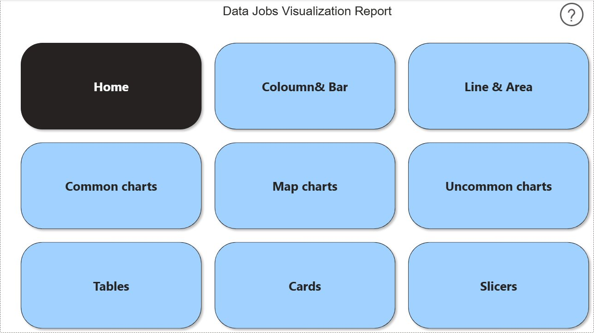
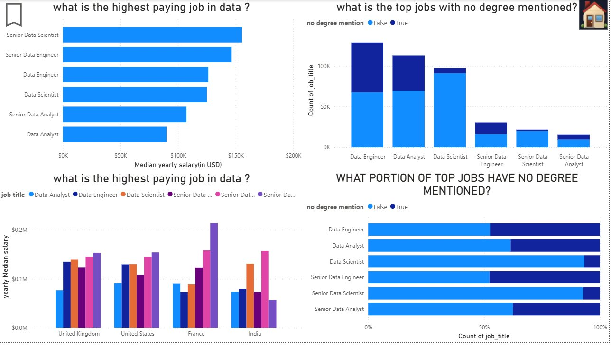
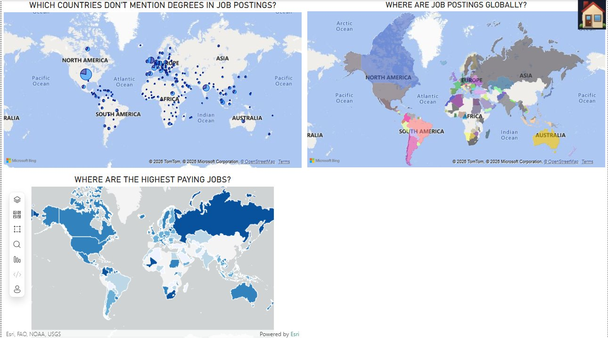
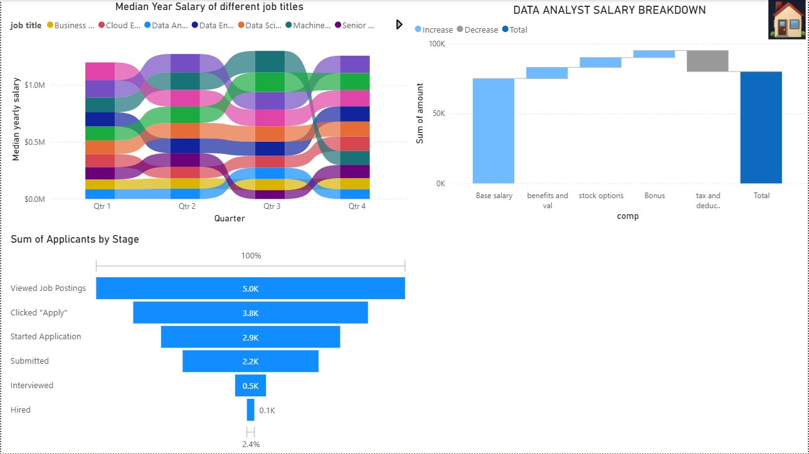
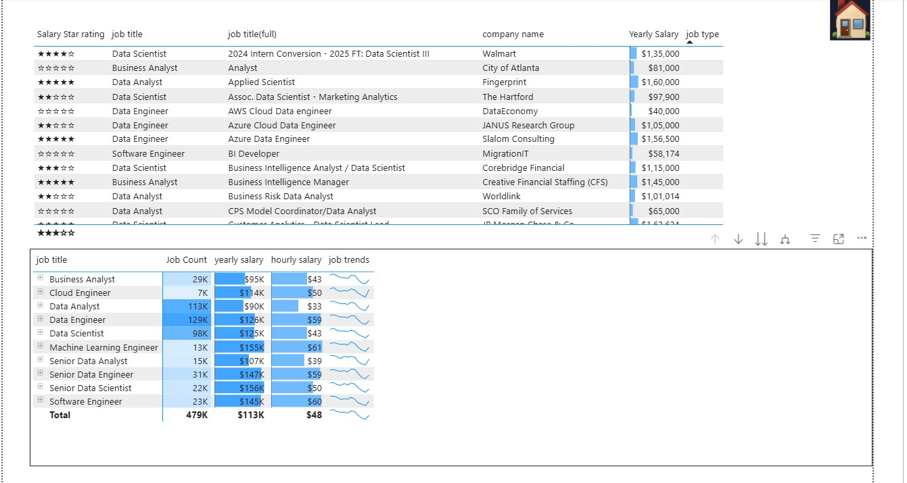
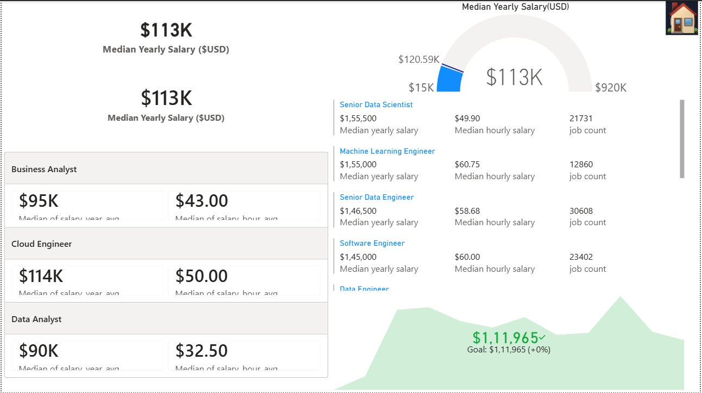

# Power BI Data Jobs Analysis 📊

An end-to-end Power BI project analyzing **479K real-world data job postings from 2024** — built across two reports covering an interactive dashboard with drill-through, and a comprehensive visualization library with 15+ chart types.

---

# Part 1 — Data Jobs Dashboard

A fully interactive Power BI dashboard answering key questions about the data jobs market — salary trends, job counts, hiring platforms, and WFH patterns — with a drill-through page for deep-diving into any specific job title.


---

## 📊 Dashboard Pages

### Main Dashboard
Answers: *What are the salary trends? How many jobs exist per title? What is the hourly vs yearly salary relationship?*


**Includes:**
- 479K total job count with salary star rating
- Median yearly salary ($113K) and median hourly salary ($47.62)
- Job trend line chart across 2024
- Hourly vs yearly salary scatter plot
- Job counts bar chart
- Summary table with sparklines showing job trends per title
- Slicer to filter by job title

---

### Job Title Drill Through
Click any job title on the main dashboard to drill through to a dedicated page showing deep insights for that specific role.


**Includes:**
- Median yearly & hourly salary gauge charts
- WFH%, No Degree Mention%, Health Insurance% donut charts
- Global job map
- Top hiring platforms bar chart
- Job types breakdown

---

## 📌 Key Features — Dashboard

- **Drill-through** — click any job title to get a dedicated insights page
- **Slicer** — filter entire dashboard by job title
- **DAX measures** — median salary, job count, salary star rating calculated measures
- **Gauge charts, scatter plots, sparklines** — advanced visual types

---

---

# Part 2 — Data Jobs Visualization Report

A comprehensive Power BI report demonstrating 15+ visualization types applied to the same dataset, with an interactive home page navigation linking to each chart category.


---

## 📁 Project Structure

```
powerbi-visualizations-demo/
├── 2_visualizations.pbix       # Power BI report file
├── images/                     # Screenshots of all report pages
└── README.md
```

---

## 🗂️ Report Pages

### 🏠 Home — Navigation Page


---

### 📊 Column & Bar Charts
Answers: *What is the highest paying job in data? Which jobs have the most postings without degree requirements?*



---

### 📈 Line & Area Charts
Answers: *What is the trend of data jobs in 2024? What portion of jobs belong to each job title over time?*


---

### 🥧 Common Charts
Answers: *What portion of postings don't mention a degree? What portion are WFH? What are the types of data jobs?*


---

### 🗺️ Map Charts
Answers: *Where are job postings globally? Which countries don't mention degrees? Where are the highest paying jobs?*



---

### 🌊 Uncommon Charts
Includes Ribbon chart, Waterfall chart, and Funnel chart applied to job market data.



---

### 📋 Tables
Detailed tabular view of job postings with salary star ratings, company names, yearly salary, and job trends sparklines.



---

### 🃏 Cards
KPI cards showing median yearly salary, median hourly salary, and job counts broken down by job title.



---

### 🎛️ Slicers
Interactive filters for job title, posting date range, and salary range — all connected across the report.


---

### 🔖 Buttons & Bookmarks
Bookmarks used to toggle between filtered/unfiltered states and show/hide slicers dynamically.


---

## 📌 Key Features — Visualization Report

- **Interactive navigation** — home page with buttons linking to each chart section
- **15+ visualization types** — column, bar, line, area, pie, donut, scatter, map, filled map, ribbon, waterfall, funnel, table, card, slicer
- **Bookmarks & buttons** — toggle views, show/hide slicers, reset filters
- **Real questions answered** — every page answers a specific business question about the data jobs market

---

---

## 📁 Project Structure

```
powerbi-data-jobs-analysis/
├── 1_Data_Jobs_Dashboard.pbix      # Main dashboard + drill through
├── 2_visualizations.pbix           # Full visualization report
├── images/                         # Screenshots and GIFs
└── README.md
```

---

## 🗃️ Dataset

**Source:** Luke Barousse's Data Jobs Dataset  
**Size:** 479,000 job postings  
**Period:** January 2024 – December 2024  
**Fields include:** job title, company name, salary (yearly & hourly), location, job type, WFH status, degree requirement, health insurance, skills

---

## 🛠️ Tools Used

- **Power BI Desktop** — report building, visualizations, bookmarks, slicers, buttons, navigation, drill-through
- **DAX** — calculated measures for median salary, job count, salary star rating

---

## 📓 Notes

Detailed documentation on how each visualization was built, including design decisions and lessons learned.

👉 [View Notes on Google Colab](https://colab.research.google.com/drive/1l9vjSmjTugoo8AjMN7IMlOIiUhUHG57d)

---

## 🔗 Related Projects

- [SQL Data Jobs Analysis](https://github.com/arnav-is-op) — SQL-based analysis of the same dataset
- [Python Job Postings Analysis](https://github.com/arnav-is-op/python_project_for_job_analysis) — Python/Pandas analysis with Matplotlib & Seaborn visualizations

---
